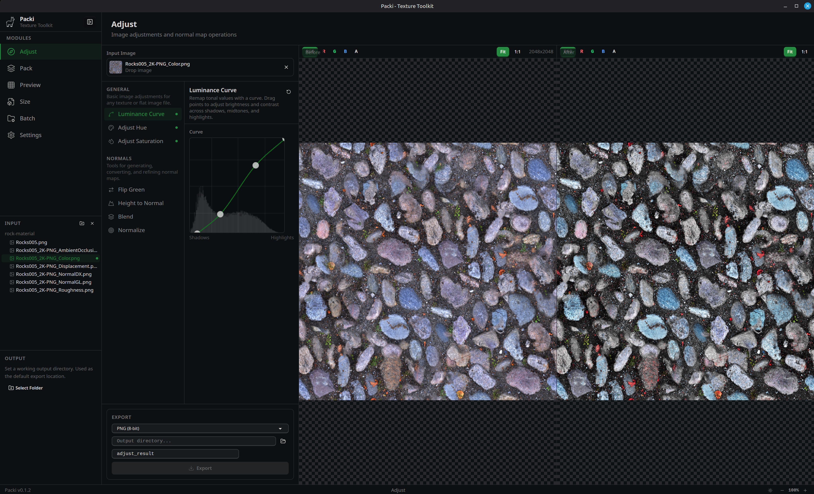
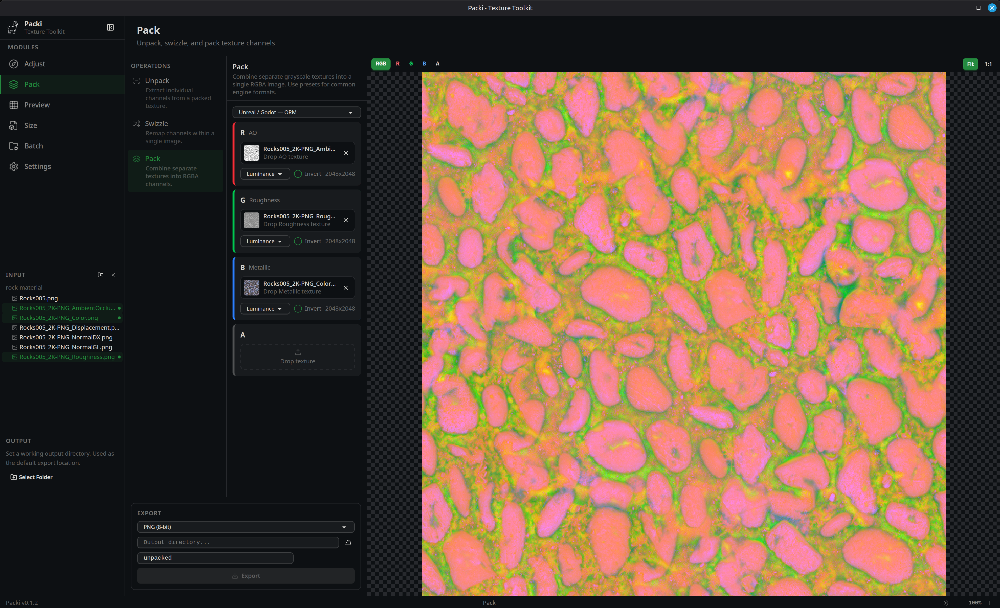
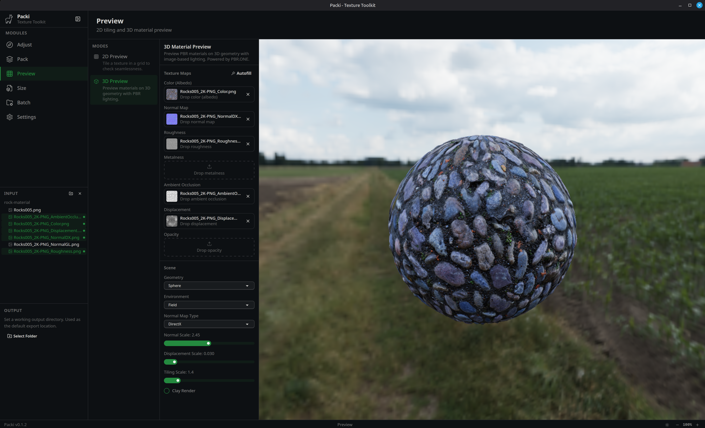
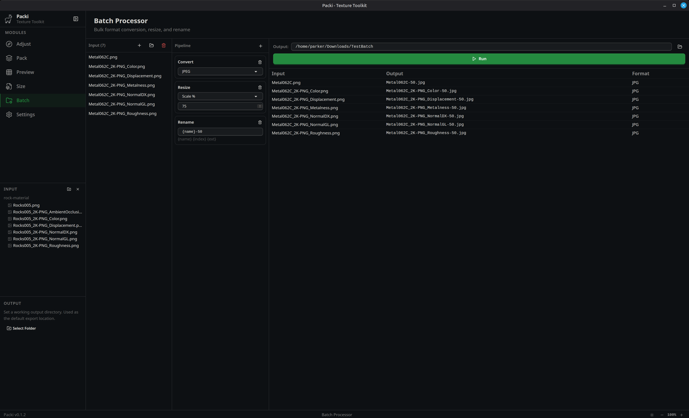

# Packi

A free, open-source, offline desktop application that bundles common game-artist texture tools into a lightweight standalone app with local-only processing.

Packi isn't a replacement for any DCC; rather, it's a helpful sidecar for texture prep that doesn't need all that extra weight: packing channels, normal map ops, batch-converting formats, adjusting curves, previewing materials, estimating VRAM budgets, etc. These are operations artists often solve with ad-hoc Photoshop actions, single-purpose web tools, or CLI utilities they'd rather not have to deal with.


## Stack

- **Runtime / Package Manager:** Bun
- **Desktop Framework:** Tauri 2 (Rust backend)
- **Frontend:** React 19 + TypeScript
- **Styling:** Tailwind CSS 4 + daisyUI 5
- **State Management:** Zustand 5
- **Image Processing:** Rust `image` + `exr` crates, parallelized with `rayon`
- **3D Rendering:** Three.js (WebGL)


## Modules

### Adjust



Color, tone, and normal map operations with interactive before/after preview.

**General Adjustments**
- **Luminance Curve** — interactive curve editor with histogram overlay for remapping tonal values
- **Hue** — shift hue across the full 360-degree color wheel
- **Saturation** — boost or reduce color saturation

**Normal Map Operations**
- **Flip Green** — convert between DirectX and OpenGL normal map conventions
- **Height to Normal** — generate a normal map from a grayscale heightmap with adjustable strength (Sobel filter)
- **Blend** — combine two normal maps using Reoriented Normal Mapping (RNM) with adjustable blend factor
- **Normalize** — re-normalize vectors to unit length after lossy compression or manual editing

All operations support undo/redo and export to PNG (8-bit, 16-bit) and TGA.

---

### Pack



Channel packing, unpacking, and swizzling for game engine texture workflows.

**Pack**
- Drag-and-drop or browse to assign source textures to R, G, B, A channels
- Pick which source channel to sample from (luminance, R, G, B, or A)
- Per-channel invert toggle
- Live preview of the packed result with channel soloing
- Built-in presets for common packing conventions (Unreal ORM, Unity HDRP Mask Map, Unity URP, RMA, Godot ORM, Substance Designer, and more)
- Save and manage custom presets

**Unpack**
- Extract individual channels from a packed texture as separate grayscale images
- 2x2 grid preview of all four channels
- Export all channels at once

**Swizzle**
- Remap channels within a single image (each output channel reads from any source channel or luminance)
- Per-channel invert
- Before/after preview

Export as PNG (8-bit, 16-bit) and TGA.

---

### Preview



Visualize textures in 2D tiling and 3D material contexts.

**2D Tiling Preview**
- Configurable grid size with repeat or mirror tiling modes
- X/Y offset controls for inspecting seam alignment
- Seam highlight overlay with adjustable color
- Pan and zoom with fit-to-window

**3D Material Preview** - Powered by PBR.ONE
- PBR previewing on multiple geometries: plane, cube, sphere, cylinder, torus
- Seven texture map slots: color, normal, roughness, metalness, AO, displacement, opacity
- Auto-fill from loaded textures
- Six environment map presets (Studio, Dune, Forest, Field, Lab, Night)
- Normal map type toggle (OpenGL/DirectX), normal scale, displacement scale, and tiling controls
- Clay render mode for debug visualization

---

### Size


Texture analysis and VRAM budget estimation.

**Texture Info**
- Resolution, channel count, bit depth, and file size at a glance

**VRAM Budget**
- Real-time cost estimation across 16+ GPU compression formats (BC1–BC7, ASTC, PVRTC, ETC2, uncompressed variants)
- Resolution scaling from 32 to 16384 px
- Toggle mip chain cost inclusion
- Interactive bar chart sorted by cost efficiency

**Mip Chain**
- Visual cascade of all mip levels with proportional sizing
- Per-level dimensions and memory cost
- Format selector for compression analysis

---

### Batch Processor



Bulk operations on texture files with a pipeline-based workflow.

- Add individual files or entire folders as input
- Build an ordered pipeline from three step types:
	- **Convert** — change format (PNG 8-bit, PNG 16-bit, TGA, JPEG)
	- **Resize** — scale by percentage, exact dimensions, or nearest power-of-two
	- **Rename** — pattern-based with `{name}`, `{index}`, `{ext}` substitution
- Preview output filenames and formats before executing
- Real-time progress tracking with per-file success/failure indicators
- Save and reload pipeline presets
- Non-destructive by default — always outputs to a separate folder


## Development

```bash
# Install dependencies
make setup

# Run in development mode
make dev

# Build for production
make build
```


## License

Covered under the GPL License, see [LICENSE](./LICENSE.md)

Beyond that, I only have one rule: **First, do no harm. Then, help where you can.**


## Financial Support

If you have some cash to spare and are inspired to share, that's very kind. Rather than sharing that kindness with me, I encourage you to share it with your charity of choice.

Mine is the [GiveWell top charities fund](https://www.givewell.org/top-charities-fund), which does excellent research to figure out which causes can save the most human lives for the money, and puts their funds there.

Their grant to the [Against Malaria Foundation](https://www.againstmalaria.com) was shown to deliver outcomes at a cost of just $1,700 per life saved.


